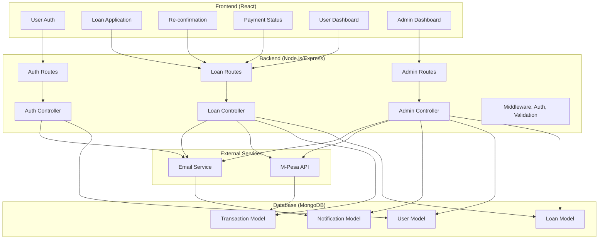
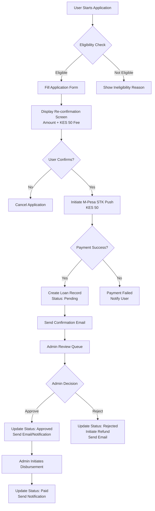

# JAMII LOAN System Architecture Design

## Overview
This document outlines the redesigned architecture for the JAMII LOAN application system, incorporating user authentication, loan application with re-confirmation and credit score validation, fixed KES 50 fee, M-Pesa STK Push payment integration, admin notification and decision logic with email notifications and refund capabilities, and enhanced dashboards.

## Current System Analysis
The existing system has:
- User authentication with JWT
- Loan application without payment at submission
- 10% variable fee calculation
- Admin approval/rejection after fee payment
- M-Pesa integration for fee payment and disbursement
- Basic dashboards

Key gaps to address:
- Fixed KES 50 fee instead of 10%
- M-Pesa STK Push for fee payment during application
- Re-confirmation step in loan application
- Credit score validation
- Refund logic for rejected applications
- Enhanced notification system

## Detailed Workflows

### 1. User Authentication Workflow
```
User Registration/Login
├── Register: fullName, email, nationalId, password, isCitizen
├── Validation: email unique, nationalId optional but unique if provided
├── Admin auto-assignment for specific emails
├── JWT token generation with 30d expiry
├── Welcome email sent asynchronously
└── Credit score initialized to 500 (1000 for admins)
```

### 2. Loan Application Workflow
```
Loan Application Process
├── User fills application form (amount, phoneNumber, description)
├── Eligibility Check:
│   ├── Must be Kenyan citizen (isCitizen: true)
│   ├── No active pending/approved loans
│   ├── Amount within loanLimit (default 50,000)
│   ├── Credit score >= 400 (configurable threshold)
│   └── National ID provided
├── Display Re-confirmation Screen:
│   ├── Loan amount
│   ├── Fixed fee: KES 50
│   ├── Total payable: amount + 50
│   ├── User details verification
│   └── Terms acceptance
├── User Confirms Application
├── Initiate M-Pesa STK Push for KES 50 fee
├── Payment Status Handling:
│   ├── Success: Create loan record (status: pending), update user.totalLoansApplied
│   ├── Failure: Cancel application, notify user
│   └── Timeout: Handle pending payments
└── Send application confirmation email
```

### 3. Payment Integration Workflow (M-Pesa STK Push)
```
M-Pesa STK Push Payment Flow
├── Initiate STK Push with phoneNumber and amount (KES 50)
├── M-Pesa sends push notification to user's phone
├── User enters M-Pesa PIN to authorize payment
├── Callback handling:
│   ├── Success: Update transaction status, proceed with loan creation
│   ├── Failure: Log error, notify user
│   └── Timeout: Implement retry mechanism (max 3 attempts)
├── Transaction record creation with M-Pesa response data
└── Security: Validate callback authenticity
```

### 4. Admin Notification and Decision Logic Workflow
```
Admin Review Process
├── Admin receives notification of new pending loan
├── Review loan details in dashboard/queue
├── Decision Options:
│   ├── Approve: Requires fee paid
│   ├── Reject: Requires reason, triggers refund
│   ├── Auto-Approve: Based on criteria (credit >=600, fee paid, valid ID, no pending loans)
│   └── Special-Approve: Manual override
├── On Approval:
│   ├── Update loan status to 'approved'
│   ├── Update user credit score (+50 for regular, +25 for auto, +100 for special)
│   ├── Send approval email and notification
│   └── Update user.totalLoansApproved
├── On Rejection:
│   ├── Update loan status to 'rejected'
│   ├── Record rejection reason
│   ├── Initiate M-Pesa refund for KES 50
│   ├── Send rejection email with reason
│   └── Send notification
└── Refund Process:
    ├── Use M-Pesa B2C reversal or refund API
    ├── Update transaction status
    └── Notify user of refund
```

### 5. Disbursement Workflow
```
Loan Disbursement Process
├── Admin initiates disbursement for approved loans
├── M-Pesa B2C transfer to user's phone
├── Update disbursement status and transaction ID
├── Send disbursement notification and email
├── Update loan status to 'paid' on successful disbursement
└── Handle failures with retry logic
```

### 6. Dashboard Workflows

#### User Dashboard
```
User Dashboard Features
├── Loan Status Tracker: Current loans with status updates
├── Application History: Past applications and outcomes
├── Payment History: Fee payments and disbursements
├── Credit Score Display: Current score and improvement tips
├── Notification Center: In-app notifications
└── Profile Management: Update details, view limits
```

#### Admin Dashboard
```
Admin Dashboard Features
├── Overview Tab: Statistics and recent activity
├── Loan Queue Tab: Real-time pending loans with quick actions
├── Statistics Tab: Comprehensive metrics
├── Loan Management: Filter, search, bulk actions
├── User Management: View user details, credit scores
├── Notification Management: Send manual notifications
└── System Settings: Configure thresholds, fees
```

## Required Changes to Existing Components

### Models Changes

#### User Model
- No changes required - existing fields sufficient

#### Loan Model
```javascript
// Changes needed:
feeAmount: {
  type: Number,
  default: 50, // Fixed KES 50 instead of calculated 10%
},
// Add if not present:
rejectionRefundStatus: {
  type: String,
  enum: ['pending', 'processed', 'failed'],
  default: null,
},
rejectionRefundTransactionId: String,
refundInitiatedAt: Date,
```

#### Transaction Model
```javascript
// Add refund tracking:
isRefund: {
  type: Boolean,
  default: false,
},
originalTransactionId: String, // For refund transactions
refundReason: String,
```

#### Notification Model
- Existing model sufficient, but ensure all types are covered

### Controllers Changes

#### loanController.js
- Update `applyForLoan`:
  - Change fee calculation to fixed 50
  - Add re-confirmation logic (frontend handles UI)
  - Integrate M-Pesa STK Push initiation
  - Handle payment callback for loan creation
- Add `confirmLoanApplication` endpoint for re-confirmation
- Update `payLoanFee` to handle STK Push instead of alternatives
- Add refund logic for rejections

#### adminController.js
- Update `rejectLoan` to include refund initiation
- Add `processRefund` method
- Ensure approval emails include correct fee amount
- Add refund status tracking

#### authController.js
- No major changes, but ensure credit score initialization

### Routes Changes

#### loanRoutes.js
```javascript
// Add new routes:
router.post('/confirm-application', confirmLoanApplication); // For re-confirmation
router.post('/stk-callback', handleStkCallback); // M-Pesa callback
router.post('/:id/refund', processRefund); // Admin refund
```

#### adminRoutes.js
- Add refund processing routes if needed

### Frontend Components Changes

#### LoanApplication.jsx
- **State Management Updates**:
  - Add `confirmationStep` state to track application progress (form → confirmation → payment)
  - Add `paymentStatus` state with values: 'idle', 'processing', 'success', 'failed', 'timeout'
  - Add `stkPushData` state to store M-Pesa transaction details
- **UI Flow Changes**:
  - Split component into steps using conditional rendering
  - Step 1: Application form (existing form with fixed KES 50 fee display)
  - Step 2: Re-confirmation modal showing summary (amount, fee, total, user details, terms)
  - Step 3: Payment processing screen with STK Push status
- **New Functionality**:
  - `handleConfirmation()`: Submit form data and show confirmation modal
  - `handlePaymentInitiation()`: Call API to start STK Push, poll for status updates
  - `handlePaymentCallback()`: Handle real-time payment status updates via WebSocket or polling
  - Update fee calculation to always show 50 instead of amount * 0.1
- **Error Handling**:
  - Payment timeout handling with retry option (max 3 attempts)
  - Clear error messages for payment failures
  - User-friendly messages for different failure scenarios

#### AdminDashboard.jsx
- **Queue Tab Enhancements**:
  - Add payment status column showing 'Fee Paid', 'Payment Pending', 'Payment Failed'
  - Color-coded status badges for payment states
  - Filter options for payment status
- **Loan Details Modal**:
  - Add payment transaction details section
  - Show M-Pesa transaction ID and timestamp
  - Display refund status for rejected loans
- **Refund Functionality**:
  - Add 'Process Refund' button for rejected loans with paid fees
  - Show refund progress with status indicators
  - Disable approval actions for loans with failed payments
- **Statistics Updates**:
  - Add payment success rate metrics
  - Refund processing statistics
  - Update fee-related calculations to use fixed KES 50

#### Dashboard.jsx (User Dashboard)
- **New Sections**:
  - Payment History: List of all fee payments and disbursements
  - Refund Notifications: Highlight any refunds processed
  - Credit Score Widget: Show current score with improvement suggestions
- **Loan Status Updates**:
  - Real-time status updates for pending payments
  - Clear indicators for payment-required vs payment-completed loans

#### AuthContext.jsx
- **Potential Updates**:
  - Add payment session management for STK Push flows
  - Store temporary application data during multi-step process
  - Enhanced error handling for payment-related API calls

#### New Components Needed

**PaymentStatus.jsx**
- Props: `status`, `transactionId`, `onRetry`, `onCancel`
- Features:
  - Animated loading spinner during 'processing'
  - Success checkmark with transaction details
  - Error messages with retry/cancel buttons
  - Timeout countdown timer
  - M-Pesa push notification instructions

**LoanReconfirmation.jsx**
- Props: `applicationData`, `onConfirm`, `onCancel`
- Features:
  - Summary table showing loan amount, fee, total
  - User details verification section
  - Terms and conditions checkbox
  - Clear call-to-action buttons
  - Responsive modal design

**RefundStatus.jsx**
- Props: `loanId`, `refundStatus`, `transactionId`
- Features:
  - Status indicators: Pending, Processing, Completed, Failed
  - Transaction details display
  - Progress bar for refund processing
  - Error messages with contact support option

**PaymentHistory.jsx**
- Props: `userId`
- Features:
  - List of all transactions (fees and disbursements)
  - Filter by type, status, date range
  - Export functionality
  - Detailed transaction modal

#### Context Updates

**LoanContext.jsx**
- Add new methods:
  - `confirmLoanApplication(data)`: Submit for confirmation
  - `initiateStkPush(data)`: Start payment process
  - `checkPaymentStatus(transactionId)`: Poll payment status
  - `processRefund(loanId)`: Handle refund requests
- Enhanced state management for payment flows
- WebSocket integration for real-time payment updates

#### API Integration Updates
- Update axios interceptors for payment timeout handling
- Add retry logic for failed payment API calls
- Enhanced error parsing for M-Pesa specific errors

## Security Considerations
- JWT token validation on all protected routes
- M-Pesa callback signature verification
- Input validation and sanitization
- Rate limiting on payment endpoints
- Secure storage of sensitive payment data
- Audit logging for admin actions

## Persistence and Consistency
- MongoDB transactions for multi-step operations
- Atomic updates for user credit scores and loan counts
- Consistent error handling with rollback capabilities
- Database indexing for performance
- Backup and recovery procedures

## High-Level System Diagram



## Loan Application Flowchart



## Implementation Priority
1. Update models for fixed fee and refund tracking
2. Implement M-Pesa STK Push integration
3. Update loan application flow with re-confirmation
4. Add refund logic for rejections
5. Enhance admin dashboard with refund capabilities
6. Update frontend components
7. Add comprehensive testing
8. Deploy and monitor

This architecture ensures a secure, user-friendly loan application system with robust payment integration and admin controls.